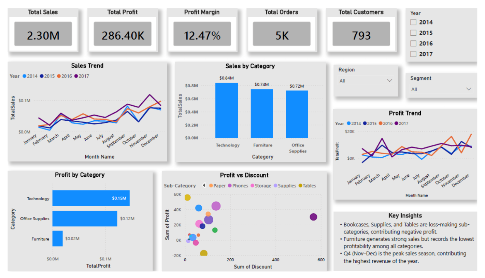

# 📊 Superstore Performance Analysis Dashboard | Power BI

An end-to-end **Power BI Business Intelligence project** built using the Superstore dataset to analyze sales, profitability, customer behavior, and business performance. The project demonstrates the complete BI workflow, including **data transformation with Power Query, data modeling, DAX calculations, and interactive dashboard development**.

---

## 🚀 Project Overview

The objective of this project is to transform raw retail sales data into actionable business insights through an interactive Power BI dashboard.

The dashboard enables users to:

* Track overall sales, profit, orders, and customer metrics.
* Analyze sales and profit trends over time.
* Compare category-level performance.
* Evaluate the impact of discounts on profitability.
* Filter insights by year, region, and customer segment.
* Identify profit-driving and loss-making areas of the business.

---

## 🛠️ Data Preparation (Power Query)

The raw dataset was cleaned and transformed using **Power Query**.

### Transformations Performed

* Created a **Ship Delay** column to calculate delivery delays.
* Validated and formatted data types.
* Prepared data for efficient reporting and modeling.

---

## 📅 Date Table Creation

A dedicated Date Table was created to support time-based analysis.

### Date Table Fields

* Date
* Year
* Month Name
* Month Number
* Quarter

This enables accurate trend analysis and time intelligence calculations.

---

## 📈 DAX Measures Created

The following key measures were developed using DAX:

```DAX
Total Sales
Total Profit
Profit Margin
Total Orders
Total Customers
```

### KPI Definitions

| KPI             | Description                     |
| --------------- | ------------------------------- |
| Total Sales     | Total revenue generated         |
| Total Profit    | Total profit earned             |
| Profit Margin   | Profit as a percentage of sales |
| Total Orders    | Total number of orders          |
| Total Customers | Unique customers served         |

---

## 📊 Dashboard Features

### KPI Cards

* Total Sales: **$2.30M**
* Total Profit: **$286.40K**
* Profit Margin: **12.47%**
* Total Orders: **5K**
* Total Customers: **793**

### Visualizations

#### Sales Trend Analysis

* Monthly sales comparison across years (2014–2017).
* Identifies seasonality and growth patterns.

#### Profit Trend Analysis

* Tracks profit performance over time.
* Helps identify profitable and underperforming periods.

#### Sales by Category

* Technology
* Furniture
* Office Supplies

#### Profit by Category

* Category-wise profitability comparison.
* Highlights high-performing categories.

#### Profit vs Discount Analysis

* Examines the relationship between discounts and profit.
* Helps identify discount strategies affecting profitability.

#### Interactive Filters

* Year
* Region
* Segment

---

## 🔍 Key Business Insights

### 1. Technology Leads Performance

Technology generates the highest sales and profit among all categories, making it the strongest contributor to overall business performance.

### 2. Furniture Has Lower Profitability

Although Furniture generates substantial sales, its profit contribution remains significantly lower compared to other categories.

### 3. Loss-Making Sub-Categories

Bookcases, Supplies, and Tables contribute negatively to overall profitability and require strategic review.

### 4. Peak Sales Season

The highest sales are observed during **Q4 (November–December)**, indicating strong year-end demand.

### 5. Discount Impact

Higher discounts do not always result in higher profits, emphasizing the importance of discount optimization.

---

## 📷 Dashboard Preview



---

## 💡 Skills Demonstrated

* Power BI
* Power Query
* Data Cleaning & Transformation
* Data Modeling
* DAX
* Business Intelligence
* Data Visualization
* KPI Development
* Dashboard Design
* Analytical Reporting

---

## 📂 Project Files

```text
├── Superstore.csv
├── Superstore Performance Analysis.pbix
├── Dashboard.png
└── README.md
```

---

## 🎯 Conclusion

This project showcases the complete Power BI development lifecycle—from data transformation and modeling to advanced DAX calculations and interactive dashboard creation. The dashboard provides meaningful insights into sales performance, profitability, customer behavior, and operational efficiency, enabling data-driven business decisions.
